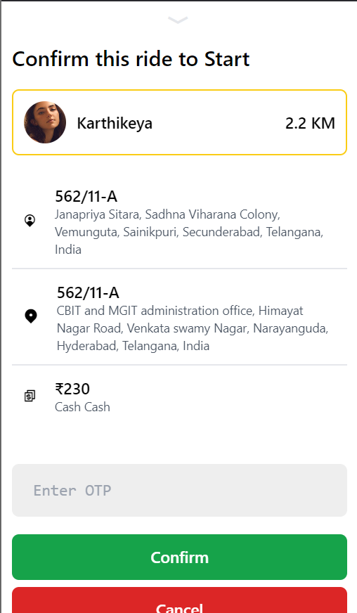

## overview

An Uber Clone Application that replicates key functionalities of a ride-hailing platform, including user authentication, ride booking, ride accepting by captain and completing ride.

## Features

- **User Authentication:** Login and registration functionality for riders and drivers.
- **Ride Booking:** Request rides, select pick-up/drop-off locations, and estimate fares.
- **Driver Dashboard:** Driver-side features to accept/reject rides, view earnings, etc.

## Techstack

- **Frontend:** React.js, Redux, Tailwind CSS
- **Backend:** Node.js, Express.js
- **Database:** MongoDB
- **APIs:** Google Maps API for geolocation and route plotting
- **Authentication:** JSON Web Tokens (JWT)
- **Others:** Socket.IO for real-time tracking

## Setup and Installation

### Prerequisites

- Node.js and npm/yarn installed
- MongoDB/PostgreSQL setup locally or on the cloud
- Google Maps API key

### Steps

#### Backend

1. Clone the repository:

```
https://github.com/BoorlaKarthikeya/UberClone_MERN.git
```

2. Navigate to the project directory:

```
cd uberClone_MERN/Backend
```

3. Install dependencies:

```
npm install
```

4. Setup environment variables:
   Create a .env file in the root directory and add:

```
PORT=5000
DB_CONNECT=<MongoDB database URL>
JWT_SECRET_KEY=<user-secret>
GOOGLE_MAPS_API_KEY=<YOUR_GOOGLE_MAPS_API_KEY>

```

5. Run the application:

```
node server.js
```

#### Frontend

2. Navigate to the project directory:

```
cd uberClone_MERN/Frontend
```

3. Install dependencies:

```
npm install
```

4. Setup environment variables:
   Create a .env file in the root directory and add:

```
VITE_BASE_URL=<server application url>
VITE_GOOGLE_MAPS_API_KEY=<your GOOGLE_MAPS_API_KEY>

```

5. Run the application:

```
npm run dev
```

### Screenshots

- User Login Page
  
- Captain Login Page
  
- User Home Page]
  
- User Ride Booking
  
- Ride Price Chart
  
- User Ride Conformation
  
- Captain Details to User
  
- Ride popup to captain
  
  Ride confirmation to captain
  

## Future Improvements

- Live tracking of the location of captain to user
- Implement ride-sharing feature
- Include push notifications
